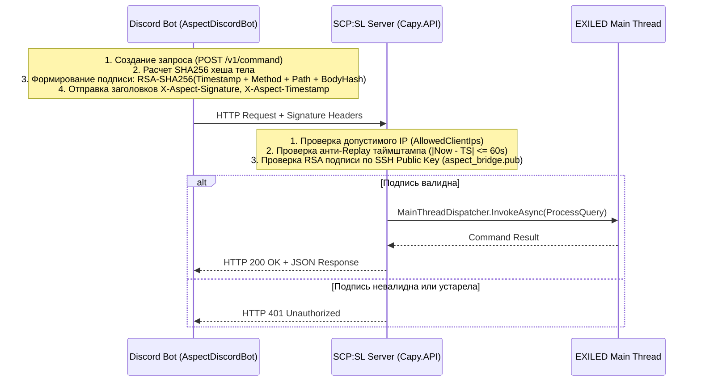

# 🛡️ Capy.API.DiscordBridge — Защищенный мост управления и логирования

Модуль **DiscordBridge** обеспечивает двустороннюю защищенную связь между серверами SCP:SL (EXILED) и Discord-ботом.

---

## 🔐 Криптографическая модель безопасности



---

## 📡 REST API Эндпоинты

| Метод | Путь | Описание |
| :--- | :--- | :--- |
| `GET` | `/v1/health` | Проверка жизнеспособности сервера и отклика игрового потока. |
| `GET` | `/v1/status` | Детальный статус: название, карта, онлайн, список живых SCP/людей, статус боеголовки, TPS. |
| `GET` | `/v1/players` | Список подключенных игроков (ник, ID, SteamID, класс, пинг, группа). |
| `GET` | `/v1/groups` | Список настроенных в `permissions.yml` групп сервера. |
| `POST` | `/v1/command` | Выполнение команды RemoteAdmin от лица пользователя Discord с контролем прав (`ra` / `creator`). |
| `GET` | `/v1/logs` | Чтение очереди серверных событий с поддержкой пагинации (`?after_id=X&limit=25`). |
| `POST` | `/v1/links/code` | Генерация 6-значного временного кода привязки для команды `/steamsl`. |
| `GET` | `/v1/links` | Получение списка всех привязанных Discord-аккаунтов. |
| `POST` | `/v1/links/sync` | Принудительная синхронизация ролей пользователя и обновление его EXILED-ранга на сервере. |

---

## 📜 Категории логируемых событий

1. **`Punishments`** — баны, кики, муты интеркома/голосового чата, разбаны.
2. **`Rounds`** — запуск/конец раунда, респавны волн (МОГ/Хаос/Длань Змея), запуск/отмена/взрыв боеголовки.
3. **`Server`** — входы/выходы игроков, смерти, перезагрузки конфигов и плагинов.
4. **`Commands`** — выполнение консольных и RA команд как из игры, так и из Discord.
5. **`Reports`** — репорты на читеров и вызовы администрации через внутриигровое меню.

---

## ⚙️ Конфигурация (`discord_bridge.yml`)

```yaml
is_enabled: true
debug_mode: false

# Сетевой адрес прослушивания
listen_prefix: "http://127.0.0.1:8123/"

# Аутентификация
require_ssh_signature: true
ssh_public_key_path: "aspect_bridge.pub"
api_key: "CHANGE_ME_FALLBACK_API_KEY_32_CHARS"
max_clock_drift_seconds: 60

# Фильтрация IP
allowed_client_ips:
  - "127.0.0.1"
  - "::1"

# Привязка аккаунтов и роли
link_code_lifetime_minutes: 10
discord_role_check_interval_seconds: 15
discord_role_remove_managed_group_when_no_match: true

# Маппинг ролей Discord -> EXILED
discord_role_mappings:
  - group: "owner"
    priority: 100
    operator: "or"
    discord_role_ids:
      - 100000000000000001
  - group: "admin"
    priority: 50
    operator: "or"
    discord_role_ids:
      - 100000000000000002
```

---

## 🎮 Внутриигровая команда

* `.linkdiscord <6-значный код>` — вводится в консоль игры (кнопка `~` или `Ё`) после получения кода в Discord через команду `/steamsl`.
