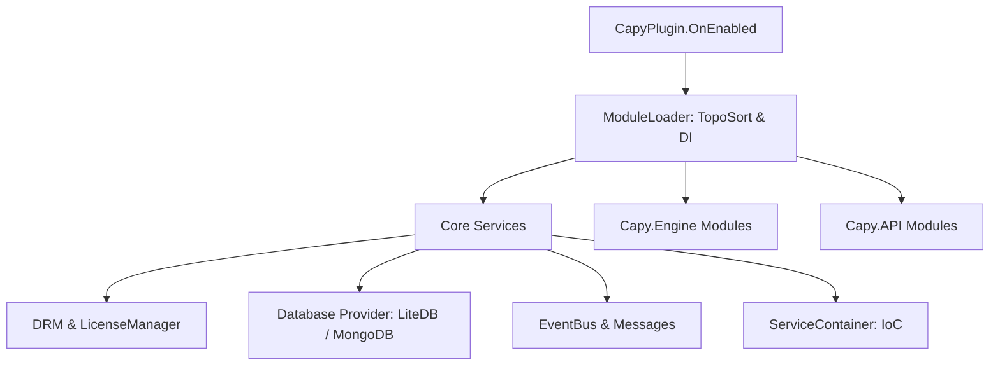

# 🧠 Capy.Core — Ядро и архитектурная основа CapyLib

`Capy.Core` — фундаментальный модуль и архитектурный каркас библиотеки **CapyLib**, предоставляющий высокопроизводительные сервисы, управление жизненным циклом компонентов, доступ к базам данных, систему защиты (DRM) и встроенный контейнер внедрения зависимостей (DI/IoC).

---

## 🏛️ Архитектура компонентов



---

## 📦 Основные подсистемы

### 1. Модульный загрузчик (`Capy.Core.Loader`)
* **Автоматическое обнаружение**: сканирует все типы сборки, реализующие интерфейс `ICapyModule`.
* **Граф зависимостей**: атрибут `[DependsOn(typeof(OtherModule))]` строит направленный ациклический граф (DAG) и разрешает порядок инициализации через алгоритм топологической сортировки.
* **Асинхронный и синхронный жизненный цикл**: поддержка методов `OnEnabled()`, `OnEnabledAsync()`, `OnDisabled()`, `OnDisabledAsync()`.
* **Автоматическая регистрация конфигураций**: каждый модуль, наследуемый от `BaseModule<TConfig>`, автоматически связывается со своим YAML/JSON конфигом.

```csharp
[DependsOn(typeof(DatabaseModule))]
public sealed class MyCustomModule : BaseModule<MyConfig>
{
    public override string Name => "MyCustomModule";
    public override string Author => "CapybaraPR";
    public override Version Version => new(1, 0, 0);

    public override void OnEnabled()
    {
        Log.Info("Модуль успешно запущен!");
    }
}
```

---

### 2. Контейнер внедрения зависимостей (`Capy.Core.Services.ServiceContainer`)
Легковесный и быстрый встроенный IoC-контейнер:
* Регистрация синглтонов (`RegisterSingleton<TInterface, TImplementation>()` или экземпляров `RegisterInstance<T>()`).
* Регистрация фабрик и переходных зависимостей (`RegisterTransient<T>()`).
* Автоматическое внедрение в конструкторы модулей и сервисов.

---

### 3. Шина событий (`Capy.Core.Services.EventBus`)
Типизированная издательско-подписная система для безопасного обмена данными между изолированными модулями:
```csharp
// Подписка на событие
EventBus.Subscribe<PlayerLevelUpEvent>(ev => 
{
    Log.Info($"Игрок {ev.Player.Nickname} повысил уровень до {ev.NewLevel}!");
});

// Публикация события
EventBus.Publish(new PlayerLevelUpEvent(player, 10));
```

---

### 4. Провайдеры баз данных (`Capy.Core.Database`)
Унифицированный слой абстракции работы с хранилищами данных:
* **LiteDB**: быстрое локальное встраиваемое NoSQL-хранилище (BSON) без необходимости разворачивать сторонние СУБД.
* **MongoDB Driver**: масштабируемая сетевая база данных для синхронизации данных между несколькими игровыми серверами (NR, MRP).
* **InMemory Database**: высокоскоростной кэш для временных сессионных данных.

---

### 5. Система защиты и лицензирования (`Capy.Core.DRM`)
* **Hardware ID Binding**: снятие цифрового отпечатка оборудования (CPU ID, Motherboard Serial, MAC-адреса).
* **Криптографическая верификация лицензий**: асимметричная RSA-проверка цифровых подписей лицензионных файлов (`license.key`).
* **Анти-тампер и контроль целостности сборки**.

---

### 6. Вспомогательные сервисы
* **`PlaceholderReplacer`**: движок динамической подстановки тегов (например, `{player_name}`, `{server_tps}`, `{round_duration}`, `{custom_item}`).
* **`CooldownService`**: потокобезопасный менеджер кулдаунов способностей и команд по `UserId` / `string`.
