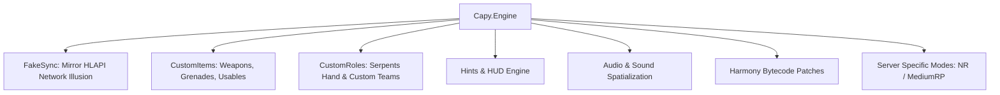

# ⚙️ Capy.Engine — Игровой движок и механики SCP:SL

`Capy.Engine` — комплекс игровых механик, сетевой синхронизации, физических эффектов, кастомного контента и графического интерфейса для серверов **CapyLib**.

---

## 🗂️ Архитектура подсистем

---

## 🧩 Подсистемы

| Директория | Назначение |
| :--- | :--- |
| **[`FakeSync/`](./FakeSync/README.md)** | Сетевая иллюзия Mirror/HLAPI: подмена `SyncVar`, `SyncList`, Fake RPC и фейковые примитивы AdminToy для индивидуальных игроков. |
| **[`CustomItems/`](./CustomItems/README.md)** | Фреймворк создания предметов с кастомным поведением, свойствами выстрела, визуалом и логикой. |
| **[`CustomRoles/`](./CustomRoles/README.md)** | Фреймворк создания ролей, фракций (Длань Змеи и др.), кастомных способностей и условий победы. |
| **[`Hints/`](./Hints/README.md)** | Продвинутая система отображения подсказок и HUD на экране с поддержкой приоритетов и плейсхолдеров. |
| **[`Audio/`](./Audio/README.md)** | Подсистема проигрывания кастомных звуковых файлов, музыки и голосовых оповещений через `AudioPlayerApi`. |
| **`Patches/`** | Низкоуровневые Harmony-патчи игровых методов для расширения возможностей базовой игры. |
| **`MediumRP/` & `NoRules/`** | Специфичные модули игровых режимов для серверов MediumRP и NoRules (NR). |
